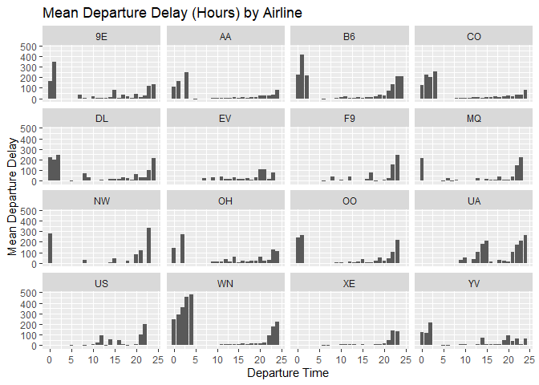
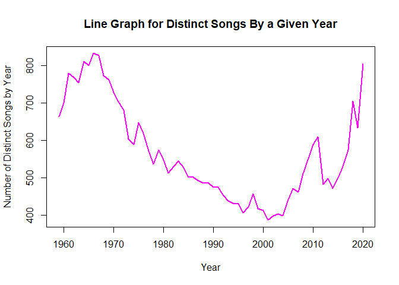
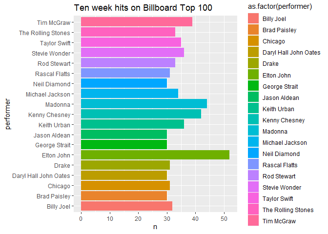
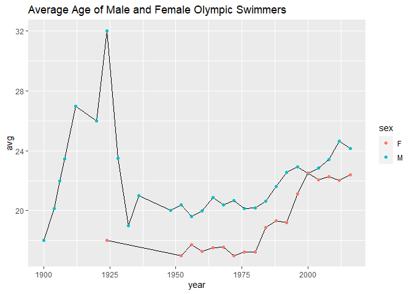
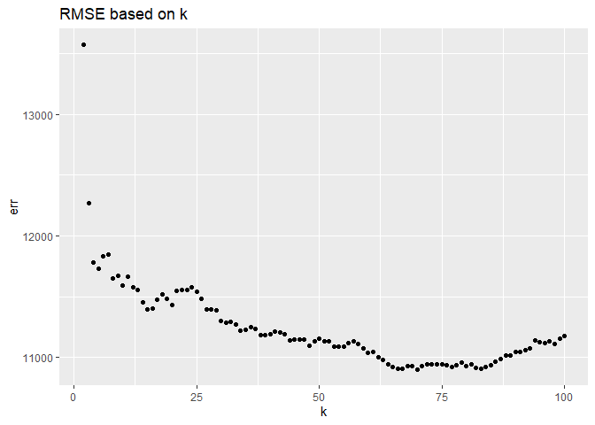
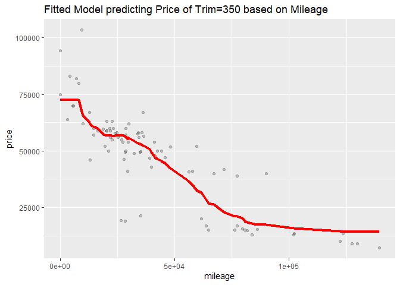
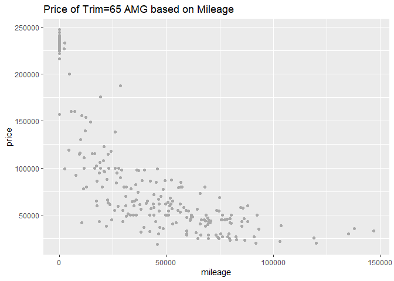
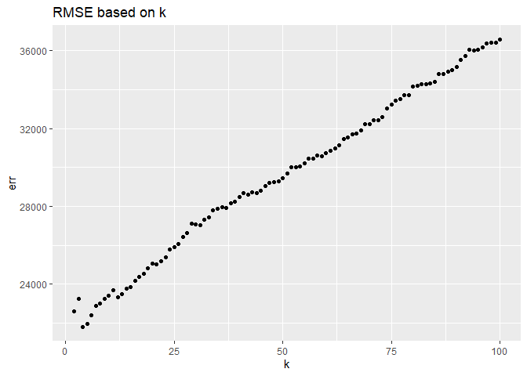
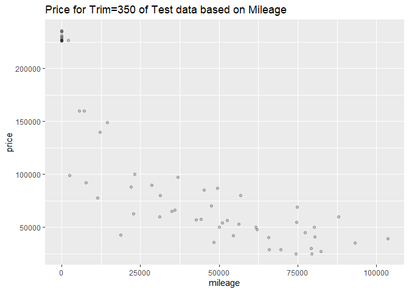
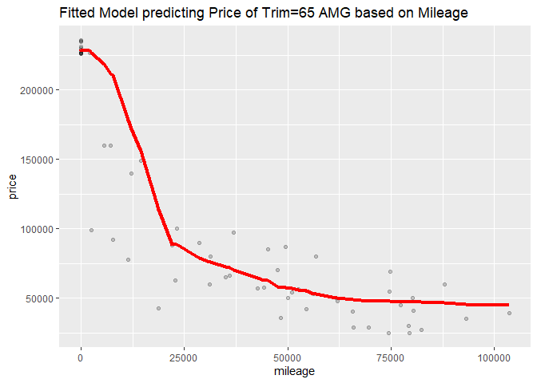

    library(tidyverse)

    ## -- Attaching packages --------------------------------------- tidyverse 1.3.1 --

    ## v ggplot2 3.3.5     v purrr   0.3.4
    ## v tibble  3.1.2     v dplyr   1.0.7
    ## v tidyr   1.1.3     v stringr 1.4.0
    ## v readr   1.4.0     v forcats 0.5.1

    ## -- Conflicts ------------------------------------------ tidyverse_conflicts() --
    ## x dplyr::filter() masks stats::filter()
    ## x dplyr::lag()    masks stats::lag()

    library(ggplot2)
    library(data.table)

    ## Warning: package 'data.table' was built under R version 4.1.2

    ## 
    ## Attaching package: 'data.table'

    ## The following objects are masked from 'package:dplyr':
    ## 
    ##     between, first, last

    ## The following object is masked from 'package:purrr':
    ## 
    ##     transpose

    library(rsample)

    ## Warning: package 'rsample' was built under R version 4.1.2

    library(caret)

    ## Warning: package 'caret' was built under R version 4.1.2

    ## Loading required package: lattice

    ## 
    ## Attaching package: 'caret'

    ## The following object is masked from 'package:purrr':
    ## 
    ##     lift

    library(modelr)

    ## Warning: package 'modelr' was built under R version 4.1.2

    library(parallel)
    library(foreach)

    ## Warning: package 'foreach' was built under R version 4.1.2

    ## 
    ## Attaching package: 'foreach'

    ## The following objects are masked from 'package:purrr':
    ## 
    ##     accumulate, when

    library(readr)
    library(dplyr)

-   1.  

<!-- -->

    ABIA <- read_csv("C:\\Users\\mantr\\Desktop\\Mona\\Masters\\Applications\\University of Texas at Austin\\Spring 22\\Data Mining\\Homework\\ABIA.csv")

    ## 
    ## -- Column specification --------------------------------------------------------
    ## cols(
    ##   .default = col_double(),
    ##   UniqueCarrier = col_character(),
    ##   TailNum = col_character(),
    ##   Origin = col_character(),
    ##   Dest = col_character(),
    ##   CancellationCode = col_character()
    ## )
    ## i Use `spec()` for the full column specifications.

    ABIA$DepartureHour <- round(ABIA$DepTime/100, 0)

-   Best time of the day to fly in or out of Austin is 5-7 AM

<!-- -->

    ABIA %>%group_by(DepartureHour) %>% summarise(mean_dep_delay = mean(DepDelay, na.rm=TRUE)) %>% arrange(mean_dep_delay)

    ## # A tibble: 26 x 2
    ##    DepartureHour mean_dep_delay
    ##            <dbl>          <dbl>
    ##  1             5         -3.50 
    ##  2             6         -2.40 
    ##  3             7         -0.944
    ##  4             8          0.131
    ##  5             9          4.01 
    ##  6            11          5.12 
    ##  7            10          5.98 
    ##  8            13          7.07 
    ##  9            12          7.61 
    ## 10            15          8.97 
    ## # ... with 16 more rows

-   The departure delay during the best time of the day to avoid delays
    (5-7AM) doesn’t change that much for different Airlines

<!-- -->

    mean_delay_by_hours <- ABIA %>% group_by(DepartureHour, UniqueCarrier) %>% summarise(mean_dep_delay = mean(DepDelay, na.rm=TRUE)) %>% arrange(mean_dep_delay) 

    ## `summarise()` has grouped output by 'DepartureHour'. You can override using the `.groups` argument.

    ggplot(mean_delay_by_hours) + geom_col(aes(x=DepartureHour, y=mean_dep_delay)) + facet_wrap(~UniqueCarrier) + labs(title = "Mean Departure Delay (Hours) by Airline") + xlab("Departure Time") + ylab("Mean Departure Delay")

    ## Warning: Removed 15 rows containing missing values (position_stack).

\* Best time of the year is Fall and Summer to fly in or out of Austin.
We see high delays in Spring and Winter, maybe due to holidays.

    ABIA <- ABIA %>% mutate(Season = ifelse(ABIA$Month %in% c(12, 1, 2), "Winter", ifelse(ABIA$Month %in% c(3, 4, 5), "Spring", ifelse(ABIA$Month %in% c(6, 7, 8), "Summer", "Fall"))))

    mean_dep_delay_by_season <- ABIA %>% group_by(Season, Dest) %>% summarise(mean_dep_delay = mean(DepDelay, na.rm=TRUE)) %>% arrange(mean_dep_delay) 

    ## `summarise()` has grouped output by 'Season'. You can override using the `.groups` argument.

    ggplot(mean_dep_delay_by_season, aes(Season, mean_dep_delay)) + geom_col()

    ## Warning: Removed 2 rows containing missing values (position_stack).

\* By grouping flying activities by destinations and sorting the data we
observed that the top 6 most popular destinations are DAL (Dallas), DFW
(Dallas), IAH (Houston), PHX (Pheonix), DEN (Denver), and ORD
(Illinois). The bar graph shows high average departure delay in Spring
especially for Dallas and Illinois. All of the 6 destinations commonly
show least average departure delay in Fall.

    ABIA %>% group_by(Dest) %>% summarise(count = n()) %>% arrange(desc(count)) 

    ## # A tibble: 53 x 2
    ##    Dest  count
    ##    <chr> <int>
    ##  1 AUS   49637
    ##  2 DAL    5573
    ##  3 DFW    5506
    ##  4 IAH    3691
    ##  5 PHX    2783
    ##  6 DEN    2673
    ##  7 ORD    2514
    ##  8 HOU    2319
    ##  9 ATL    2252
    ## 10 LAX    1733
    ## # ... with 43 more rows

    top_dest <- c("DAL", "DFW", "IAH", "PHX", "DEN", "ORD")

    mean_dep_delay_by_season_top_dest <- mean_dep_delay_by_season %>% filter(Dest %in% top_dest)

    ggplot(mean_dep_delay_by_season_top_dest, aes(Season, mean_dep_delay)) + geom_col() + facet_wrap(~Dest) + labs(title = "Mean Departure Delay by Top Destination for each Season") + xlab("Seasons") + ylab("Mean Departure Delay")

-   2A.

<!-- -->

    billboard <- read.csv("C:\\Users\\mantr\\Desktop\\Mona\\Masters\\Applications\\University of Texas at Austin\\Spring 22\\Data Mining\\Homework\\billboard.csv")

    billboard %>%
      group_by(song, performer) %>%
      summarise(count = n()) %>%
      arrange(desc(count)) %>%
      head(10)

    ## `summarise()` has grouped output by 'song'. You can override using the `.groups` argument.

    ## # A tibble: 10 x 3
    ## # Groups:   song [10]
    ##    song                              performer                             count
    ##    <chr>                             <chr>                                 <int>
    ##  1 Radioactive                       Imagine Dragons                          87
    ##  2 Sail                              AWOLNATION                               79
    ##  3 Blinding Lights                   The Weeknd                               76
    ##  4 I'm Yours                         Jason Mraz                               76
    ##  5 How Do I Live                     LeAnn Rimes                              69
    ##  6 Counting Stars                    OneRepublic                              68
    ##  7 Party Rock Anthem                 LMFAO Featuring Lauren Bennett & Goo~    68
    ##  8 Foolish Games/You Were Meant For~ Jewel                                    65
    ##  9 Rolling In The Deep               Adele                                    65
    ## 10 Before He Cheats                  Carrie Underwood                         64

-   Caption: The top 10 most popular song since 1958 as measured by the
    total number of weeks that a song spent on the Billboard Top 100.

-   Analysis: From the table, we see that Radioactive by Imagine Dragons
    is highly popular. It stayed on Billboard Top 100 for 87 weeks.
    Sail, Blinding Lights, and I’m Yours follow closely with the total
    number of weeks spent on the Billboard top 100 equal to 79, 76, and
    76 respectively.

-   2B.

<!-- -->

    plot_df = billboard %>% select(song_id, year) %>% distinct() %>% group_by(year) %>% count()
    plot_df = plot_df %>% filter(year != 1958 & year != 2021)
    plot(plot_df$year, plot_df$n, 'l', lwd = 2, col = "magenta",
         xlab = "Year", ylab = "Number of Distinct Songs by Year", 
         main = "Line Graph for Distinct Songs By a Given Year")

 \* Caption:
Line graph showing number of unique songs each year from 1959 to 2020.
\* Analysis: We see an increasing trend in musical diversity (as
measured by number of unique songs) during 1960 and reached its peak at
1965. After that number of unique songs declined drastically and reached
its lowest value of 400 in the year 2000. Then, the trend rose
exponentially again until 2020.

-   2C.

<!-- -->

    billboard %>% filter(weeks_on_chart >= 10) %>% select(performer, year) %>% group_by(year) %>% 
      count()

    ## # A tibble: 64 x 2
    ## # Groups:   year [64]
    ##     year     n
    ##    <int> <int>
    ##  1  1958   373
    ##  2  1959  1367
    ##  3  1960  1313
    ##  4  1961   941
    ##  5  1962  1026
    ##  6  1963   794
    ##  7  1964   632
    ##  8  1965   566
    ##  9  1966   588
    ## 10  1967   590
    ## # ... with 54 more rows

    b = billboard %>% group_by(song_id, performer) %>% 
      summarize(noofweeks = n()) %>% 
      filter(noofweeks >= 10) %>% group_by(performer) %>% count() %>% filter(n >= 30)

    ## `summarise()` has grouped output by 'song_id'. You can override using the `.groups` argument.

    ggplot(data = b, aes(y = performer, x = n, fill = as.factor(performer))) + geom_col() + labs(title = "Ten week hits on Billboard Top 100")

 \* Caption:
The horizontal bar graph displays total number of song appeared on ten
weeks hit for each 19 artists. \* Analysis: Ten weeks hit is for the
songs that appear on Billboard Top 100 for at least 10 weeks. There are
19 artists with at least 30 songs on ten weeks hit. For example, Elton
John had 52 songs on ten week hit, meaning, each of the 52 songs was
featured on Billboard Top 100 for at least 10 weeks. Madonna had 44
songs on ten weeks hit followed by Kenny Chesney who had 42 songs.

-   3A.

<!-- -->

    olympics_top20 <- read.csv("C:\\Users\\mantr\\Desktop\\Mona\\Masters\\Applications\\University of Texas at Austin\\Spring 22\\Data Mining\\Homework\\olympics_top20.csv")

    h = olympics_top20 %>% filter(sex == 'F' & sport %like% "Athle") %>% 
      select(height)

    quantile(h$height, c(.95))

    ## 95% 
    ## 183

-   The 95th percentile of heights for female across all Athletics
    events is 183 cm. This means that 95% of the height for female
    across all Athletics events is 183 cm or lower.

-   3B.

<!-- -->

    olympics_top20 %>% filter(sex == 'F') %>% select(height, event) %>%   
      group_by(event) %>% 
      summarize(stdev = sd(height)) %>% arrange(desc(stdev)) %>% 
      slice(c(1))

    ## # A tibble: 1 x 2
    ##   event                      stdev
    ##   <chr>                      <dbl>
    ## 1 Rowing Women's Coxed Fours  10.9

-   Rowing Women’s Coxed Fours had the greatest variability in
    competitor’s height as measured by standard deviation of 10.9.

-   3C.

<!-- -->

    av = olympics_top20 %>% filter(sport == 'Swimming') %>% 
      group_by(year, sex) %>% 
      summarize(avg = mean(age))

    ## `summarise()` has grouped output by 'year'. You can override using the `.groups` argument.

    mal = av %>% filter(sex == 'M')
    fem = av %>% filter(sex == 'F')

    ggplot() + geom_line(data = mal, aes(x = year, y = avg, group = 1)) + 
      geom_point(data = mal, aes(x = year, y = avg, group = 1, color = sex)) +
      geom_line(data = fem, aes(x = year, y = avg, group = 1)) + 
      geom_point(data = fem, aes(x = year, y = avg, group = 1, color = sex)) +
      labs(title = "Average Age of Male and Female Olympic Swimmers")

 \* The trend
for average age of Olympic swimmers fluctuated a lot since 1900. \* The
trend of the average age for Olympic male swimmers reached its peak in
the year 1924 with the value of 32 years old. Then the average age
dropped drastically and reached its minimum in the year 1932 with the
value of 19 years old. After that, the trend has been rising slowly and
reached the average age of 24.13 in the year 2016. \* The trend for
women, on the other hand, remained low until 1975. Then it rose
drastically to reach its peak value of 22.5 in 2000. After that, the
average ages had been more or less constant at around 22 years old. \*
The trends for male and female differed substantially and seemed to show
no correlation. The average age for male reached its peak in the year
1924 with the value of 32 years old. While the average ages for women
was highest in 2000 with the value of 22.5. Overall, the trend of
average ages for men declined, plateaued and then increased at a
decreasing rate over time. On the contrary, the trend rose over time for
women.

-   1.  

<!-- -->

    cars <- read.csv("C:\\Users\\mantr\\Desktop\\Mona\\Masters\\Applications\\University of Texas at Austin\\Spring 22\\Data Mining\\Homework\\sclass.csv")

    cars_350 = cars %>% filter(trim == '350')

    summary(cars_350)

    ##        id            trim             subTrim           condition        
    ##  Min.   :  282   Length:416         Length:416         Length:416        
    ##  1st Qu.:14290   Class :character   Class :character   Class :character  
    ##  Median :26658   Mode  :character   Mode  :character   Mode  :character  
    ##  Mean   :26520                                                           
    ##  3rd Qu.:39599                                                           
    ##  Max.   :52220                                                           
    ##   isOneOwner           mileage            year         color          
    ##  Length:416         Min.   :     6   Min.   :1994   Length:416        
    ##  Class :character   1st Qu.: 19264   1st Qu.:2006   Class :character  
    ##  Mode  :character   Median : 29998   Median :2012   Mode  :character  
    ##                     Mean   : 42926   Mean   :2010                     
    ##                     3rd Qu.: 63479   3rd Qu.:2012                     
    ##                     Max.   :173000   Max.   :2013                     
    ##  displacement           fuel              state              region         
    ##  Length:416         Length:416         Length:416         Length:416        
    ##  Class :character   Class :character   Class :character   Class :character  
    ##  Mode  :character   Mode  :character   Mode  :character   Mode  :character  
    ##                                                                             
    ##                                                                             
    ##                                                                             
    ##  soundSystem         wheelType          wheelSize          featureCount   
    ##  Length:416         Length:416         Length:416         Min.   :  0.00  
    ##  Class :character   Class :character   Class :character   1st Qu.: 31.75  
    ##  Mode  :character   Mode  :character   Mode  :character   Median : 54.00  
    ##                                                           Mean   : 49.22  
    ##                                                           3rd Qu.: 70.00  
    ##                                                           Max.   :112.00  
    ##      price       
    ##  Min.   :  6600  
    ##  1st Qu.: 19401  
    ##  Median : 52900  
    ##  Mean   : 46854  
    ##  3rd Qu.: 61991  
    ##  Max.   :106010

    ggplot(data = cars_350) + 
      geom_point(mapping = aes(x = mileage, y = price), color='darkgrey') +
      labs(title = "Price of Trim=350 based on Mileage")

    # test train split
    cars_350_split = initial_split(cars_350, prop=0.8)
    cars_350_train = training(cars_350_split)
    cars_350_test  = testing(cars_350_split)

    k_grid = c(2, 4, 6, 8, 10, 15, 20, 25, 30, 35, 40, 45,
               50, 60, 70, 80, 90, 100)

    k_grid = seq(2,100, by=1)

    cv_350_grid = foreach(k = k_grid, .combine='rbind') %dopar% {
      knn = knnreg(price ~ mileage, data=cars_350_train, k=k)
      rms = rmse(knn, cars_350_test)
      c(k=k, err=rms)
    } %>% as.data.frame

    ## Warning: executing %dopar% sequentially: no parallel backend registered

    head(cv_350_grid)

    ##          k      err
    ## result.1 2 13570.89
    ## result.2 3 12271.15
    ## result.3 4 11778.61
    ## result.4 5 11734.81
    ## result.5 6 11834.34
    ## result.6 7 11846.81

    ggplot(cv_350_grid) + 
      geom_point(aes(x=k, y=err)) +
      labs(title = "RMSE based on k")

      scale_x_log10()

    ## <ScaleContinuousPosition>
    ##  Range:  
    ##  Limits:    0 --    1

    cv_grid_output = cv_350_grid %>% filter(err == min(cv_350_grid$err))
    cv_grid_output$k

    ## [1] 70

    knn = knnreg(price ~ mileage, data=cars_350_train, k=cv_grid_output$k)

    cars_350_test = cars_350_test %>%
      mutate(price_350_pred = predict(knn, cars_350_test))

    pred_350_test = ggplot(data = cars_350_test) + 
      geom_point(mapping = aes(x = mileage, y = price), alpha=0.2) +
      labs(title = "Price for Trim=350 of Test data based on Mileage")
    pred_350_test

    # now add the predictions
    pred_350_test + geom_line(aes(x = mileage, y = price_350_pred), color='red', size=1.5) +
      labs(title = "Fitted Model predicting Price of Trim=350 based on Mileage")

    cars_65 = cars %>% filter(trim == '65 AMG')

    summary(cars_65)

    ##        id            trim             subTrim           condition        
    ##  Min.   : 1060   Length:292         Length:292         Length:292        
    ##  1st Qu.:13977   Class :character   Class :character   Class :character  
    ##  Median :26557   Mode  :character   Mode  :character   Mode  :character  
    ##  Mean   :26444                                                           
    ##  3rd Qu.:38687                                                           
    ##  Max.   :52326                                                           
    ##   isOneOwner           mileage            year         color          
    ##  Length:292         Min.   :     1   Min.   :2006   Length:292        
    ##  Class :character   1st Qu.:    20   1st Qu.:2007   Class :character  
    ##  Mode  :character   Median : 28803   Median :2010   Mode  :character  
    ##                     Mean   : 33700   Mean   :2010                     
    ##                     3rd Qu.: 58496   3rd Qu.:2015                     
    ##                     Max.   :146975   Max.   :2015                     
    ##  displacement           fuel              state              region         
    ##  Length:292         Length:292         Length:292         Length:292        
    ##  Class :character   Class :character   Class :character   Class :character  
    ##  Mode  :character   Mode  :character   Mode  :character   Mode  :character  
    ##                                                                             
    ##                                                                             
    ##                                                                             
    ##  soundSystem         wheelType          wheelSize          featureCount   
    ##  Length:292         Length:292         Length:292         Min.   :  0.00  
    ##  Class :character   Class :character   Class :character   1st Qu.: 17.00  
    ##  Mode  :character   Mode  :character   Mode  :character   Median : 58.00  
    ##                                                           Mean   : 48.09  
    ##                                                           3rd Qu.: 72.00  
    ##                                                           Max.   :112.00  
    ##      price       
    ##  Min.   : 18990  
    ##  1st Qu.: 48711  
    ##  Median : 79995  
    ##  Mean   :117121  
    ##  3rd Qu.:225975  
    ##  Max.   :247075

    # plot the data
    ggplot(data = cars_65) + 
      geom_point(mapping = aes(x = mileage, y = price), color='darkgrey') +
      labs(title = "Price of Trim=65 AMG based on Mileage")

    # test train split
    cars_65_split = initial_split(cars_65, prop=0.8)
    cars_65_train = training(cars_65_split)
    cars_65_test  = testing(cars_65_split)

    k_grid = c(2, 4, 6, 8, 10, 15, 20, 25, 30, 35, 40, 45,
               50, 60, 70, 80, 90, 100)

    k_grid = seq(2,100, by=1)

    cv_65_grid = foreach(k = k_grid, .combine='rbind') %dopar% {
      knn = knnreg(price ~ mileage, data=cars_65_train, k=k)
      rms = rmse(knn, cars_65_test)
      c(k=k, err=rms)
    } %>% as.data.frame

    head(cv_65_grid)

    ##          k      err
    ## result.1 2 22616.38
    ## result.2 3 23259.03
    ## result.3 4 21812.68
    ## result.4 5 21944.76
    ## result.5 6 22419.52
    ## result.6 7 22898.59

    ggplot(cv_65_grid) + 
      geom_point(aes(x=k, y=err)) +
      labs(title = "RMSE based on k")

      scale_x_log10()

    ## <ScaleContinuousPosition>
    ##  Range:  
    ##  Limits:    0 --    1

    cv_grid_65_output = cv_65_grid %>% filter(err == min(cv_65_grid$err))
    cv_grid_65_output$k

    ## [1] 4

    knn = knnreg(price ~ mileage, data=cars_65_train, k=cv_grid_output$k)

    cars_65_test = cars_65_test %>%
      mutate(price_65_pred = predict(knn, cars_65_test))

    pred_65_test = ggplot(data = cars_65_test) + 
      geom_point(mapping = aes(x = mileage, y = price), alpha=0.2) +
      labs(title = "Price for Trim=350 of Test data based on Mileage")
    pred_65_test

    # now add the predictions
    pred_65_test + geom_line(aes(x = mileage, y = price_65_pred), color='red', size=1.5)  +
      labs(title = "Fitted Model predicting Price of Trim=65 AMG based on Mileage")

 \* trim = 350
yields a larger optimal k of 17 over 13 in case of trim = 65 AMG \* The
sample size for trim = 350 is higher than that for trim = 65. If we have
larger sample size, we can afford higher k without the bias being too
high. This is because you’re averaging the points around the
neighborhood. This is about bias-variance trade off. On the contrary, if
you have small sample size, you’re averaging the data points further
away, causing the bias to be high.
