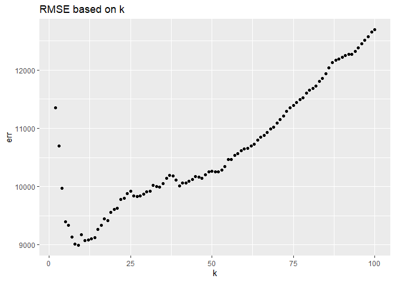
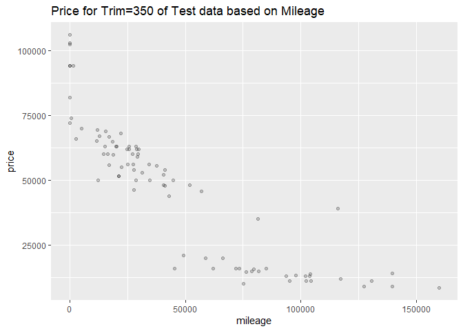
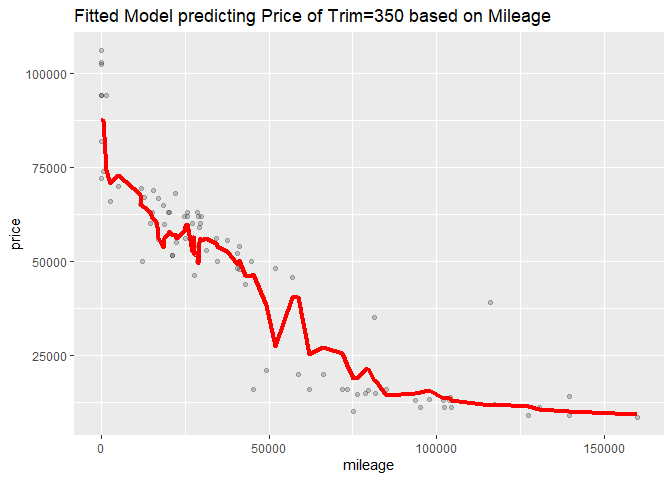
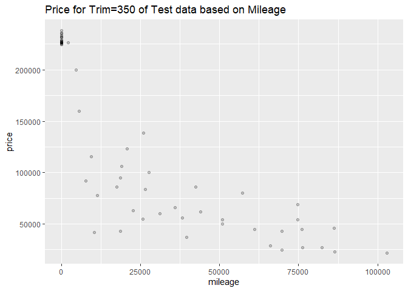
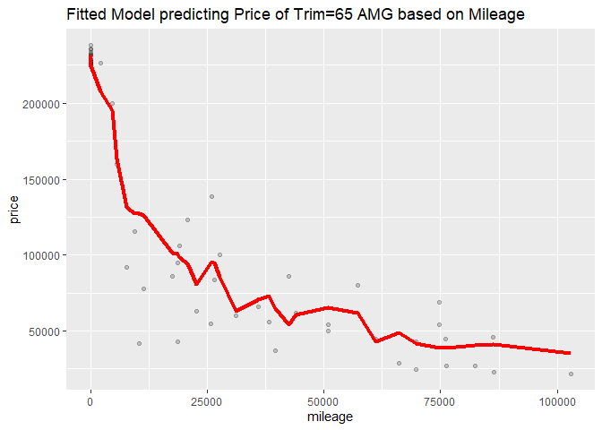

-   Question I.

-   Best time of the day to fly in or out of Austin is 5-7 AM

<!-- -->

    ## # A tibble: 26 x 2
    ##    DepartureHour mean_dep_delay
    ##            <dbl>          <dbl>
    ##  1             5         -3.50 
    ##  2             6         -2.40 
    ##  3             7         -0.944
    ##  4             8          0.131
    ##  5             9          4.01 
    ##  6            11          5.12 
    ##  7            10          5.98 
    ##  8            13          7.07 
    ##  9            12          7.61 
    ## 10            15          8.97 
    ## # ... with 16 more rows

-   The departure delay during the best time of the day to avoid delays
    (5-7AM) doesn’t change that much for different Airlines

-   Best time of the year is Fall and Summer to fly in or out of Austin.
    We see high delays in Spring and Winter, maybe due to holidays.

-   By grouping flying activities by destinations and sorting the data
    we observed that the top 6 most popular destinations are DAL
    (Dallas), DFW (Dallas), IAH (Houston), PHX (Pheonix), DEN (Denver),
    and ORD (Illinois). The bar graph shows high average departure delay
    in Spring especially for Dallas and Illinois. All of the 6
    destinations commonly show least average departure delay in Fall.

<!-- -->

    ## # A tibble: 53 x 2
    ##    Dest  count
    ##    <chr> <int>
    ##  1 AUS   49637
    ##  2 DAL    5573
    ##  3 DFW    5506
    ##  4 IAH    3691
    ##  5 PHX    2783
    ##  6 DEN    2673
    ##  7 ORD    2514
    ##  8 HOU    2319
    ##  9 ATL    2252
    ## 10 LAX    1733
    ## # ... with 43 more rows

-   Question 2A.

<!-- -->

    ## # A tibble: 10 x 3
    ## # Groups:   song [10]
    ##    song                              performer                             count
    ##    <chr>                             <chr>                                 <int>
    ##  1 Radioactive                       Imagine Dragons                          87
    ##  2 Sail                              AWOLNATION                               79
    ##  3 Blinding Lights                   The Weeknd                               76
    ##  4 I'm Yours                         Jason Mraz                               76
    ##  5 How Do I Live                     LeAnn Rimes                              69
    ##  6 Counting Stars                    OneRepublic                              68
    ##  7 Party Rock Anthem                 LMFAO Featuring Lauren Bennett & Goo~    68
    ##  8 Foolish Games/You Were Meant For~ Jewel                                    65
    ##  9 Rolling In The Deep               Adele                                    65
    ## 10 Before He Cheats                  Carrie Underwood                         64

-   Caption: The top 10 most popular song since 1958 as measured by the
    total number of weeks that a song spent on the Billboard Top 100.

-   Analysis: From the table, we see that Radioactive by Imagine Dragons
    is highly popular. It stayed on Billboard Top 100 for 87 weeks.
    Sail, Blinding Lights, and I’m Yours follow closely with the total
    number of weeks spent on the Billboard top 100 equal to 79, 76, and
    76 respectively.

-   Question 2B.

-   Caption: Line graph showing number of unique songs each year from
    1959 to 2020.

-   Analysis: We see an increasing trend in musical diversity (as
    measured by number of unique songs) during 1960 and reached its peak
    at 1965. After that number of unique songs declined drastically and
    reached its lowest value of 400 in the year 2000. Then, the trend
    rose exponentially again until 2020.

-   Question 2C.

-   Analysis: Ten weeks hit is for the songs that appear on Billboard
    Top 100 for at least 10 weeks. There are 19 artists with at least 30
    songs on ten weeks hit. For example, Elton John had 52 songs on ten
    week hit, meaning, each of the 52 songs was featured on Billboard
    Top 100 for at least 10 weeks. Madonna had 44 songs on ten weeks hit
    followed by Kenny Chesney who had 42 songs.

-   Question 3A.

<!-- -->

    ## 95% 
    ## 183

-   The 95th percentile of heights for female across all Athletics
    events is 183 cm. This means that 95% of the height for female
    across all Athletics events is 183 cm or lower.

-   Question 3B.

<!-- -->

    ## # A tibble: 1 x 2
    ##   event                      stdev
    ##   <chr>                      <dbl>
    ## 1 Rowing Women's Coxed Fours  10.9

-   Rowing Women’s Coxed Fours had the greatest variability in
    competitor’s height as measured by standard deviation of 10.9.

-   Question 3C.

-   The trend for average age of Olympic swimmers fluctuated a lot
    since 1900.

-   The trend of the average age for Olympic male swimmers reached its
    peak in the year 1924 with the value of 32 years old. Then the
    average age dropped drastically and reached its minimum in the year
    1932 with the value of 19 years old. After that, the trend has been
    rising slowly and reached the average age of 24.13 in the year 2016.

-   The trend for women, on the other hand, remained low until 1975.
    Then it rose drastically to reach its peak value of 22.5 in 2000.
    After that, the average ages had been more or less constant at
    around 22 years old.

-   The trends for male and female differed substantially and seemed to
    show no correlation. The average age for male reached its peak in
    the year 1924 with the value of 32 years old. While the average ages
    for women was highest in 2000 with the value of 22.5. Overall, the
    trend of average ages for men declined, plateaued and then increased
    at a decreasing rate over time. On the contrary, the trend rose over
    time for women.

-   Question 4.

    ##          k       err
    ## result.1 2 13115.992
    ## result.2 3 10958.993
    ## result.3 4 10577.554
    ## result.4 5 10002.574
    ## result.5 6  9705.304
    ## result.6 7  9845.751

    ## <ScaleContinuousPosition>
    ##  Range:  
    ##  Limits:    0 --    1

    ## [1] 9

    ##          k      err
    ## result.1 2 26977.08
    ## result.2 3 27427.95
    ## result.3 4 28596.11
    ## result.4 5 28959.61
    ## result.5 6 29289.40
    ## result.6 7 29419.34

    ## <ScaleContinuousPosition>
    ##  Range:  
    ##  Limits:    0 --    1

    ## [1] 2

-   trim = 350 yields a larger optimal k than that in case of trim = 65
    AMG
-   The sample size for trim = 350 is higher than that for trim = 65. If
    we have larger sample size, we can afford higher k without the bias
    being too high. This is because you’re averaging the points around
    the neighborhood. This is about bias-variance trade off. On the
    contrary, if you have small sample size, you’re averaging the data
    points further away, causing the bias to be high.
